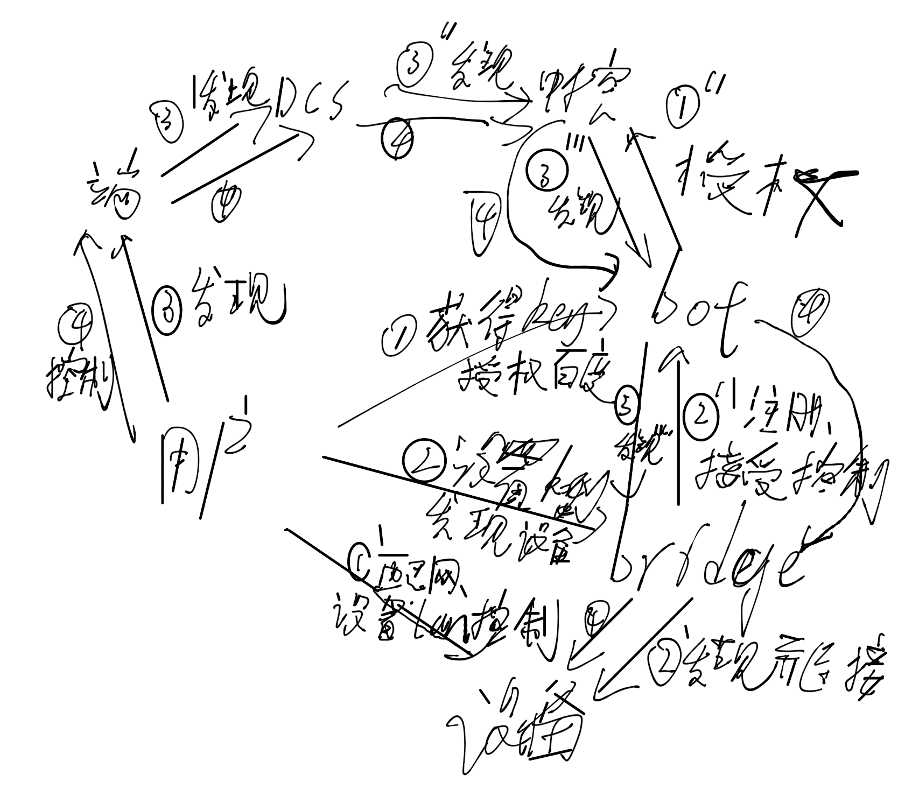

## 功能


配合[百度DuerOS](https://dueros.baidu.com/open)，使集成DuerOS的设备，支持控制yeelight灯（局域网控制模式）。比如以下设备：

  * [DOSS（德仕）小度AI音箱智能语音助手](https://item.jd.com/17807259586.html)
  * [苏宁小Biu音箱](https://product.suning.com/0000000000/10144312171.html)

这是一个本地brige服务，需要跑在局域网中的一台电脑上，推荐使用树莓派或者废弃的linux电脑

## 使用方法：

### 配置yeelight的灯泡为局域网控制模式

请参考[yeelight的官方网址](https://www.yeelight.com/zh_CN/developer)

### 安装bridge服务

先安装node，过程不再赘述

执行以下脚本启动服务

```shell
wget "https://github.com/wwwppp0801/duer_iot_local_bridge/archive/master.zip"
unzip master.zip
cd duer_iot_local_bridge-master
npm install
cp config.js.example config.js
```

修改 config.js中的ip和端口，ip为本地局域网ip，端口为任意不冲突的端口，然后启动```node index.js```

### 授权

浏览器访问上面config.js中控制的端口，如[http://192.168.1.101:3001](http://192.168.1.101:3001)，点击其中的“获得key”和“发现设备”，应该能得到合法的key和yeelight设备列表。

可以修改设备的名字为自己想要的

### 使用

对配置完成的音箱说“发现设备”，然后就可以控制了，比如说“打开客厅的灯”（设备的名字是“客厅的灯”）


## 整体流程



## bot服务：

[bot服务](http://wangp.org:8081/wangpeng/duer_iot_bot_service)

## bridge 服务

### 面向用户：

* 登录、授权
    * 跳转到bot服务，完成登录、授权，最后获得key
    * 设置key到当前用户
* 登录授权完成的话，带key，发起到bot服务的长连接
* 发现设备
    * 验证access token

### 面向bot：

* 发现设备
    * 返回当前设备列表
* 控制设备
    * 本地控制（miio等协议）
